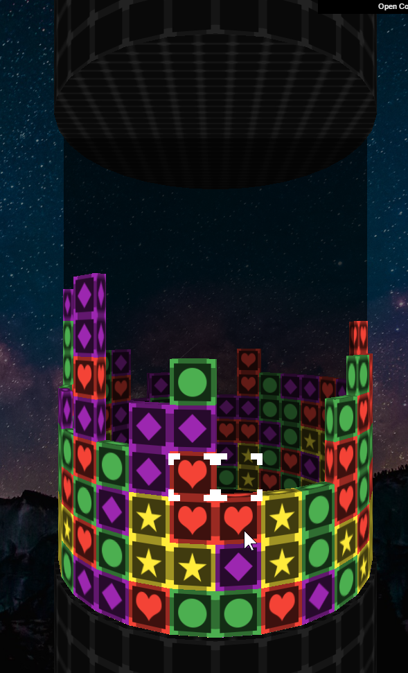

# PuzzleCylinder
Re-creating The 3D Mode from [Pokemon Puzzle League](https://en.wikipedia.org/wiki/Pok%C3%A9mon_Puzzle_League) in Three JS

## How to Play
Match blocks in groups of 3 or more vertically or horizontally to destroy blocks and earn points!

The tower slowly moves up, adding more blocks as the game goes on.

You keep playing until you're overrun with blocks, and the tower reaches the top of the cylinder.

### Desktop Controls
* **Arrow Keys** - Move Cursor 
* **Spacebar** - Swap Blocks
### Mobile Controls
* **Swipe Left / Right / Up / Down** - Move Cursor
* **Double Tap** - Swap Blocks 

